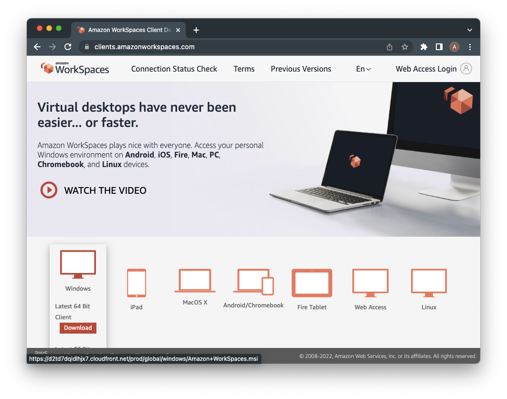
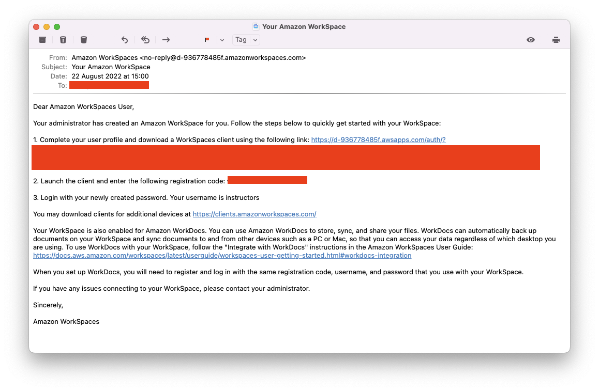
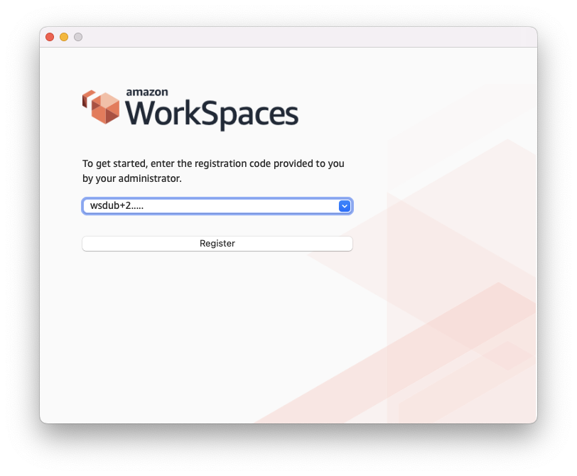
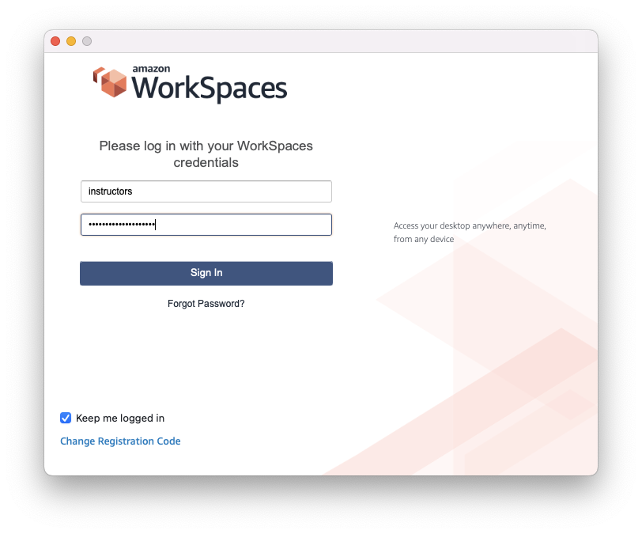
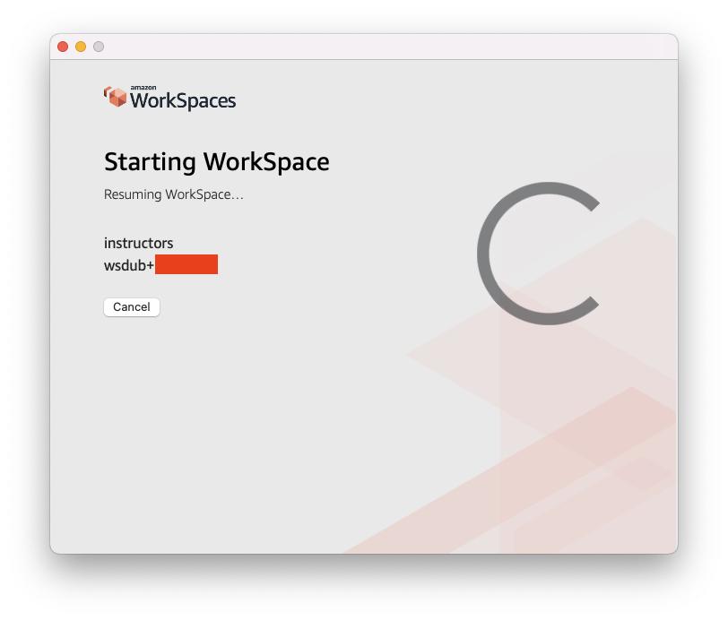
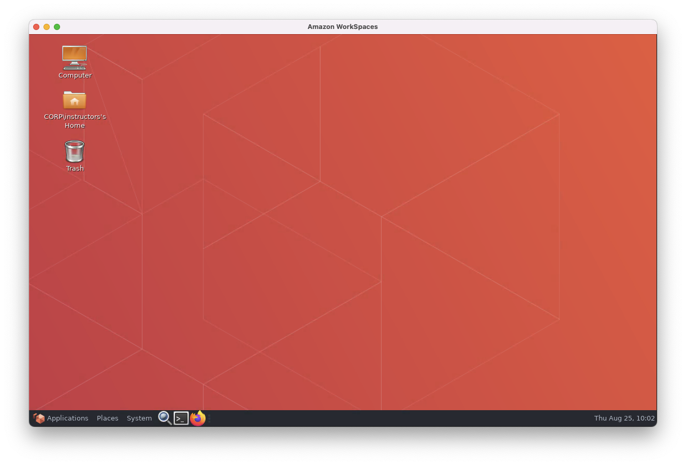
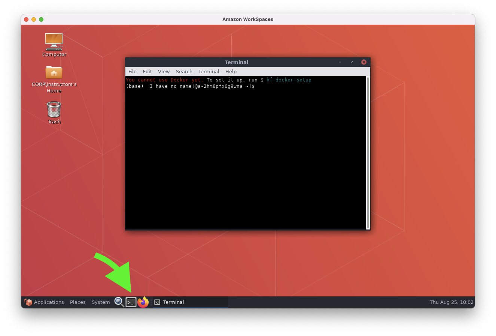
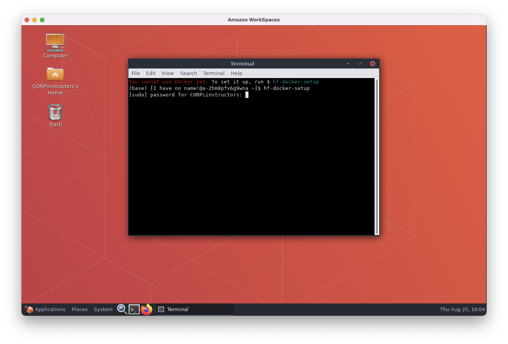

.. _vminstructions:
Accessing the virtual training infrastructure
=============================================

.. important::
   * **You need to bring a laptop with you for the practical sessions.**

   * **You need to install the** `AWS Workspaces Client <https://clients.amazonworkspaces.com/>`_.

The practical sessions of this course use a variety of software tools.
These are all publicly available (mostly open course), but installing them takes time and can be a bit fiddly on some systems.

We will therefore be using virtual machines for the course, where everything is installed for you.

These virtual machines are "AWS WorkSpaces" – virual machines in a data centre, run by Amazon in Ireland, running Amazon Linux 2 (which is based on Red Hat Linux).

Step 1 (before the course): find and bring a suitable laptop
-------------------------------------------------------------

Any fairly modern Linux (most distros), Windows (8.1 or 10), or MacOS (10.8.1+, ideally 10.12 Sierra+) laptop with WiFi access should be fine. A Chromebook from 2019 or newer is also likely to work. An iPad/Android tablet can theoretically work, if you are used to working on this with a physical keyboard.

Step 2 (before the course): install the AWS WorkSpaces Client software
-----------------------------------------------------------------------

On your laptop, before the course, please download and install the `AWS Workspaces Client <https://clients.amazonworkspaces.com/>`_.

   Download the appropriate client software for your laptop. Install it using the normal process for your machine. Make sure you can open the client software and see a window asking for a registration code.

Step 3a (just before the course): receive an email with your credentials
------------------------------------------------------------------------

You will receive an email from "Amazon WorkSpaces", from an address like ``no-reply@d-936778485f.amazonworkspaces.com``.

   The link in this email lets you set up your virtual machine password.

Step 3b: set your password
--------------------------

Follow the link in the email, and set up a password.
**Remember this password! You will need to type it each time you do a course practical session.**

Step 4: logon to your virtual machine
-------------------------------------

You can try this before the course if you like.

Open the AWS WorkSpaces Client application you installed (probably just called "WorkSpaces" on your machine).

   Put the registration code from the welcome email into client software. This code is the same for everybody.

   Enter your username (also in the welcome email), and the password you created.

   Wait a couple of minutes (or make some tea...) while the virtual machine starts. This can take a couple of minutes. If it is more than 10, please contact the course organisers/instructors.

   Eventually, a virtual computer desktop will appear in a window on your computer.

Step 5: find the Terminal
-------------------------

All of the practical sessions involve at least some work in the command line (Terminal).

   The Terminal application on these virtual machines is launched from a black rectangle icon near the bottom left of the screen.

Step 6: setup Docker
--------------------

In the Terminal, you'll be greeted by a warning that Docker isn't set up yet.
Run the suggested command to set it up (you only need to do this once).

   Type ``hf-docker-setup`` into the Terminal, and press enter. Then type your password and press enter again. Note that your password won't appear on the screen as you type.

Step 7: setup Conda
-------------------

Each time you open a Terminal, you'll see a similar message the Conda needs to be initialized.
You can run the similar command (``hf-conda-setup``). Whenever a practical session tells you to run `conda activate....`, you will need to have run ``hf-conda-setup`` first.

----

FAQ
---

How long do we have the VM for?
~~~~~~~~~~~~~~~~~~~~~~~~~~~~~~~~

The virtual machines will be available for 24 hours after the course ends.

How do I save my work from the VM?
~~~~~~~~~~~~~~~~~~~~~~~~~~~~~~~~~~

The virtual machines have full internet access, so you can use a service like Dropbox or Google Drive to save anything you want for later.
This course documentation will be available after the course too, so you don't need to save these instructions.
`Magic Wormhole <https://magic-wormhole.readthedocs.io/en/latest/>`_ is also installed on the VMs, so you could use that to send bigger files to your own computer if you like (by installing it on your own computer too).

Can I SSH into the VM?
~~~~~~~~~~~~~~~~~~~~~~

It is possible, but needs some complicated setup. If you really, really need this for some reason, please ask the instructors.

Can I use RStudio?
~~~~~~~~~~~~~~~~~~

Sort of, it is installed. BUT... Rstudio doesn't play very nicely with Anaconda-installed R environments... so quite a lot of packages (things like ``ggplot2``) will not work in Rstudio, unfortunately.
For all of the practical sessions, you can use command-line based ``R`` instead of Rstudio.

If you prefer an environment a bit like RStudio, you could use Jupyter Lab. To install it in an existing conda environment, you can run ``conda install -c r r-irkernel; pip3 install jupyterlab; jupyter lab`` and open an R notebook.