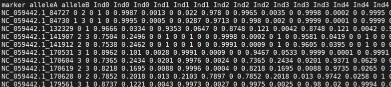
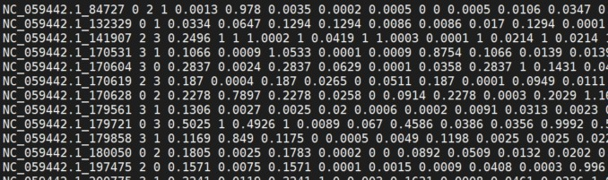
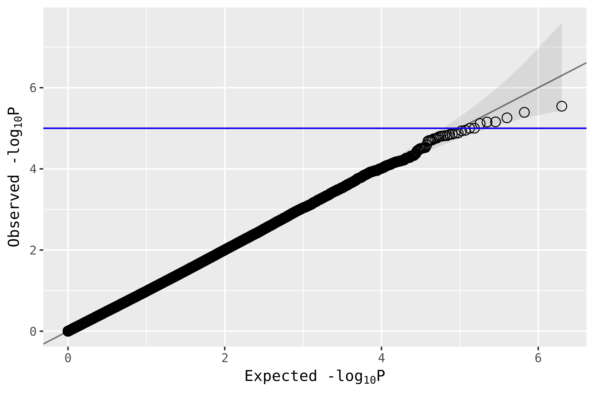
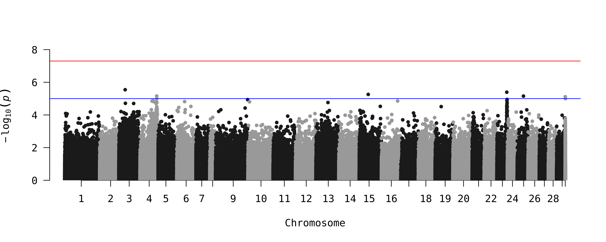
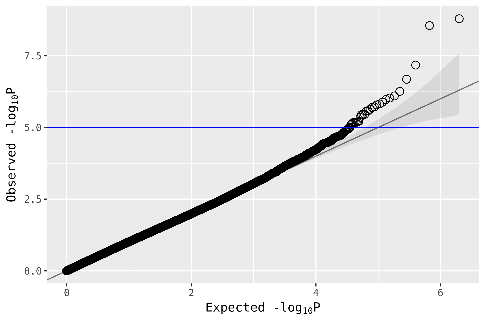
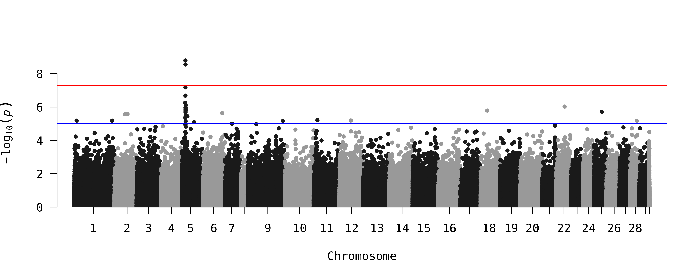

```{r setup, include=FALSE}
.libPaths("C:/Users/jaelleb/R/Rv4.2.1rc_libs/")
library(knitr)
library(ggplot2)
library(reshape2)
library(RColorBrewer)
library(cowplot)
library(qqman)


knitr::opts_chunk$set(echo = TRUE)

```

# Host variation data practical session

## Dataset description

For this practical, we will be working with genomes and metagenomes from farmed Atlantic salmon.
Shotgun metagenomics libraries were prepared from gut content samples. After adapter removal and other quality control steps,
we aligned the reads to the salmon reference genome, using methods described in the first half of this session.

The unmapped metagenomic reads were then used to generate MAGs, to characterise the salmon gut microbiome, 
using a similar pipeline as covered in the Metagenomics session on Day 1.

The mapped genomic reads were used to identify single nucleotide polymorphisms (SNPs) in our samples compared to the published reference genome.
Our genomes are relative low coverage (mean: 4X, range: 0.0003-17.3X), so instead of calling genotypes, we generated genotype likelihoods instead,
using [ANGSD](http://www.popgen.dk/angsd/index.php/ANGSD)

Processing steps included:

- Identifying callable regions with [GATK](https://gatk.broadinstitute.org/hc/en-us) (i.e. excluding regions of the genome that had extremely low or extremely high coverage)
- Generating genotype likelihoods with [ANGSD](http://www.popgen.dk/angsd/index.php/ANGSD)
- Linkage-disequilibrium pruning with [plink](https://www.cog-genomics.org/plink/1.9/ld)

To identify population structure, we also ran [PCangsd](http://www.popgen.dk/software/index.php/PCAngsd) on the pruned likelihoods and generated a PCA, which will be used as covariates in GEMMA (see Step 2).

Due to time constraints, we won't be running these steps in this practical.

## Starting files

The following input files are needed to start the practical:

- `genetic_data/genotype_probabilities_all_LDpruned_noheader.dose.gz` : mean genotype probabilities file (see Step 0)
- `genetic_data/GCF_905237065.1_Ssal_v3.1_genomic.gff.gz`: salmon reference genome annotation file
- `genetic_data/genotype_probabilities_all_LDpruned_SNPanno.txt`: SNP annotation file (all SNPs included in genotype probabilities file with SNP name, position and chromosome ID
- `data/individual-phenotype-data.csv`: salmon sample metadata (e.g. sea pen, size, etc; also includes PCA coordinates from PCangsd)
- `data/metagenome-abundance-data.csv`: salmon metagenome MAG abundance data

In case you get stuck during the practical, expected output files can be found in `expected_output/`

## Step 0: Generate genotype probabilities

ANGSD produces genotype likelihoods; however, GWAS should be ran on imputed genotype probabilities.
We used [BEAGLE v3.3.2](http://faculty.washington.edu/browning/beagle/b3.html)
(note later versions of BEAGLE do not accept ANGSD `.beagle` files as output. 
Again, we have already run this step for you, due to the resources needed (on this dataset, this step took 60 hours with 40 cores & 1000GB RAM).

BEAGLE produces both a `gprobs` genotype probabilities file and a `dose` file. The gprobs file typically looks like this:



The first 3 columns correspond to the SNP name and the major and minor alleles (with the alleles coded as 0=A, 1=C, 2=G, 3=T).
The other columns correspond to the genotype likelihoods for each individual, in sets of three: major/major genotype likelihood, 
major/minor genotype likelihood and minor/minor genotype likelihood.

However, GEMMA requires the input in "BIMBAM" file format (or PLINK Binary PED format, but we won't be covering that in this session). 
This format requires the genotype file to be mean genotypes, also known as genotype doses. View the doses file produced by BEAGLE:

```{bash eval = FALSE}
less -S genetic_data/genotype_probabilities_all_LDpruned_noheader.dose.gz
```




In this format, each SNP for each individual has a value from 0 to 2, based on the following calculation:

`mean genotype = 2 x P(minor/minor) + 1 x P(major/minor) + 0 x P(major/major)`

The SNP annotation file looks like this, with the SNP name in the first column (ChromosomeName_Position), the position on the chromosome in the second column and the chromosome number in the last column:

```{bash}
head -5 genetic_data/genotype_probabilities_all_LDpruned_SNPanno.txt
```
## Step 1: Prepare microbiome composition data

In a microbiome-GWAS, microbiome composition data (e.g. taxon abundance) are used as the phenotypes of interest. 
These can be abundance data or presence/absence data generated from any method of characterising the microbiome, 
including 16S amplicon sequencing, shotgun metagenomics sequencing, etc.

Today, we will use abundance and presence/absence of the MAGs generated from the salmon gut.

If you haven't already, first activate the conda environment we will be using for this session:
```{bash eval = FALSE}
conda activate mgwas-env
```

And make a directory to store the output in:
```{bash eval = FALSE}
mkdir output/
```

Then open R or RStudio and load the following libraries:

```{r eval = FALSE}
library(ggplot2)
library(reshape2)
```

Now load our microbiome data:

```{r}
metag.data <- read.csv("data/metagenome-abundance-data.csv", row.names = 1)
head(metag.data)
```
Each row is a salmon individual and each column has the abundance value of a particular MAG.

Now load the salmon metadata:

```{r}
salmon.data <- read.csv("data/individual-phenotype-data.csv")
head(salmon.data)
```
Again, each row is the salmon individual, while the columns include information collected about the individual during sampling, such as the sea pen it came from (`Sea.pen`),
it's mass during sampling (`Mass.kg`) and whether a parasitic worm was observed in its gut (`Parasite.detected`). There are also some host genomic variables that we will talk about later.

Let's plot the microbiome community composition:

```{r fig.height=7, fig.width=15}
metag.long <- melt(as.matrix(metag.data), varnames = c("Fish.ID","MAG"), value.name = "abundance")

ggplot(metag.long, aes(Fish.ID, MAG, fill = abundance))+
  geom_tile()+
  scale_fill_gradient(low="white", high="blue")+
  theme_bw()+
  theme(title = element_text(size = 16), 
        axis.text = element_text(size = 14, colour = "black"), axis.text.x = element_blank(),
        legend.text = element_text(size = 14, colour = "black"))
```

The community in these salmon is dominated by MAG01. However, several other MAGs are present in some samples at lower abundances, as can be seen if we view presence/absence of MAGs in the community instead.

```{r fig.height=7, fig.width=15}
metag.long$presence <- ifelse(metag.long$abundance > 0, 1, 0) 
#if abundance is > 0, MAG is present so return value 1; if not, return value 0

ggplot(metag.long, aes(Fish.ID, MAG, fill = as.factor(presence)))+
  geom_tile()+
  scale_fill_manual(values=c("white","blue"))+
  labs(fill = "presence")+
  theme_bw()+
  theme(title = element_text(size = 16), 
        axis.text = element_text(size = 14, colour = "black"), axis.text.x = element_blank(),
        legend.text = element_text(size = 14, colour = "black"))

# MAG presence/absence in wide format
metag.binary <- dcast(metag.long, Fish.ID ~ MAG, value.var = "presence")
row.names(metag.binary) <- metag.binary$Fish.ID
metag.binary <- as.matrix(metag.binary[,-1])

# Most frequently detected MAGs
sort(colSums(metag.binary), decreasing = T)
```

Normally, I would run microbiome-GWAS with MAG abundances for MAGs detected in at least 50 samples and for MAG presence/absence for MAGs detected in at least 10 samples (these numbers are loose guides). For today's session, we will only run microbiome-GWAS for:

- abundance of MAG01
- presence of MAG05

Quantitative phenotypes like abundance should be normalised to a gaussian distribution, while binary phenotypes like presence/absence should be labelled with 0 values as controls and 1s as cases. MAG presence/absence is already in this format in the `metag.binary` matrix. However, MAG01 abundance is very skewed:

```{r}
ggplot(metag.data, aes(MAG01))+
  geom_histogram(binwidth = 1)+
  labs(x = "abundance", title = "MAG01")+
  theme_bw()+
  theme(plot.title = element_text(size = 16),
        axis.title = element_text(size = 16), 
        axis.text = element_text(size = 14, colour = "black"),
        legend.text = element_text(size = 14, colour = "black"))
```

In GWAS studies, it is common to use the Inverse Normal Transformation (INT) to force skewed data into a normal distribution. This transformation basically ranks each sample's abundance from highest to lowest, then reassigns the abundance value to fit a normal distribution. However, first we should exclude samples where MAG01 was not detected and thus abundance values are 0 (we can label these as NA, then GEMMA will skip these samples).

```{r}
pheno.for.gemma <- data.frame(
  Fish.ID=row.names(metag.data),
  MAG01_abundance=metag.data$MAG01
  )

pheno.for.gemma[which(pheno.for.gemma$MAG01_abundance == 0),"MAG01_abundance"] <- NA

# Function for INT
qtrans <-
  function(x){
    k<-!is.na(x)
    ran<-rank(x[k])
    y<-qnorm((1:sum(k)-0.5)/sum(k))
    x[k]<-y[ran]
    x
  }

pheno.for.gemma$MAG01_INT=qtrans(pheno.for.gemma$MAG01_abundance)

ggplot(pheno.for.gemma, aes(MAG01_INT))+
  geom_histogram(binwidth = 0.1)+
  labs(x = "INT-abundance", title = "MAG01")+
  theme_bw()+
  theme(plot.title = element_text(size = 16),
        axis.title = element_text(size = 16), 
        axis.text = element_text(size = 14, colour = "black"),
        legend.text = element_text(size = 14, colour = "black"))
```

The sample order for all GEMMA inputs needs to be the same, as Sample IDs are not provided. This includes the SNP data input beagle file. If this file was generated with ANGSD, then the sample order will be the same as the file input order used in the original ANGSD command. For this dataset, the sample order is stored as the variable `HostG.beagle.order` in `salmon.data`. We can add the MAG05 presence data to the `pheno.for.gemma` dataframe, then reorder the dataframe to match `HostG.beagle.order`. We can then write this to a text file for GEMMA.

```{r}
# Add MAG05 presence data
pheno.for.gemma <- cbind.data.frame(
  pheno.for.gemma[match(pheno.for.gemma$Fish.ID, row.names(metag.binary)),], 
  data.frame(MAG05_presence=metag.binary[match(pheno.for.gemma$Fish.ID, row.names(metag.binary)),"MAG05"])
  )

pheno.for.gemma <- merge(pheno.for.gemma, salmon.data[,c("Fish.ID","HostG.beagle.order")], all = T)
# Reorder to match SNP data file
pheno.for.gemma <- pheno.for.gemma[order(pheno.for.gemma$HostG.beagle.order),]

# Write phenotypes to text file
# Tab delimited, don't include colnames
write.table(pheno.for.gemma[,c("Fish.ID","MAG01_INT","MAG05_presence")], 
            "microbiome-phenotypes-for-gemma.txt", 
            sep = "\t", row.names = F, quote = F, col.names = F)
```

## Step 2: Prepare individual covariate data

GEMMA can take into account covariates that may affect the output, e.g. batch effects or other experimental factors. For the linear model, GEMMA needs an intercept term. If no covariates are included, GEMMA will automatically include an intercept. However, if a covariates file *is* included, then it must include the intercept term as the first column (usually a column of 1s). For this dataset, salmon were from two different pens, which might introduce some pen-specific bias. Some individuals were also infected by a gut parasite. We also have individuals with a range of sizes (from 1 to 10 kg in mass). We know from previous studies that pen environment and parasite infection can affect microbiome composition, and size can be influenced by genetics, so we will include these variables as covariates. Size can remain as a continuous variable, but parasite detection and sea pen should be converted to binary 0s and 1s.

```{r}
# include the intercept term, mass and convert sea pen & parasite detection to binary 
covariates.for.gemma <- data.frame(
  Fish.ID=salmon.data$Fish.ID,
  Intercept=1,
  Mass.kg=salmon.data$Mass.kg,
  Sea.pen=ifelse(salmon.data$Sea.pen == "Pen1",0,1),
  Parasite.detected=ifelse(salmon.data$Parasite.detected,1,0)
)
```

GWAS can also be affected by population genetic structure, which should also be taken into account in the model. Previously population structure was evaluated for this dataset using PCangsd, to produce a PCA. From this PCA, we can see that the salmon population is highly related, but some population structure is evident:

```{r}
ggplot(salmon.data, aes(HostG.PC1, HostG.PC2, fill=Mass.kg, shape=Sea.pen))+
  geom_vline(xintercept = 0, linetype = 3, size = 1, color = "grey42")+
  geom_hline(yintercept = 0, linetype = 3, size = 1, color = "grey42")+
  geom_point(size = 3, color = "black")+
  scale_shape_manual(values = c(21,24))+
  scale_fill_gradient(low = "blue", high = "yellow")+
  labs(x = "PC1 (5.5%)", y = "PC2 (3.2%)", shape = "Sea pen", fill = "Mass (kg)")+
  theme_bw()+
  theme(axis.text = element_text(color = "black"))
```


We will therefore include the first 5 PCs from the PCA as covariates. 

```{r}
covariates.for.gemma <- cbind.data.frame(
  covariates.for.gemma,
  salmon.data[,c("HostG.PC1","HostG.PC2","HostG.PC3","HostG.PC4","HostG.PC5")]
)
```

And again, we need to make sure the final covariates file has the same sample order as the SNP data file. Then we can write it to a text file for GEMMA input.

```{r}
# Reorder to match SNP data file
covariates.for.gemma <- covariates.for.gemma[match(
  salmon.data[order(salmon.data$HostG.beagle.order),"Fish.ID"], 
  covariates.for.gemma$Fish.ID
  ),]

# Write covariates to text file
# Tab delimited, don't include colnames, don't include Fish.ID
write.table(covariates.for.gemma[,-1], 
            "covariates-for-gemma.txt", 
            sep = "\t", row.names = F, quote = F, col.names = F)
```

Now we have finished preparing our data for GEMMA, we can leave R and go back to the terminal to run GEMMA.


## Step 3: Run GEMMA

GEMMA must be run separately for each phenotype. Let's start with MAG01 abundance. 

### GEMMA run for MAG01 abundance

We will run GEMMA in two steps. First, a relatedness matrix must be generated. This corrects for fine-level population structure not captured by PCA.
Like with many farmed animals, the salmon in this dataset are highly related, so it's particularly important to account for relatedness in this population.

Linear mixed models like GEMMA can overcorrect p-value inflation when the relatedness matrix is run on the same regions of the genome as the association test.
It is therefore common to use a 'leave-one-chromosome-out' or LOCO strategy. With LOCO, the association test is run separately for each chromosome, 
and all the *other* chromosomes are used for the relatedness matrix calculation. 
For example, today we will run GEMMA on chr5, so we will use chr 1-4 & 6-30 for the relatedness matrix.

First we need to create two files: a list of the SNPs on chr5 to be included in the association test, and a list of SNPs **not** on chr5 to be used for the relatedness matrix.
We can create these lists from the SNP annotation file.


```{bash eval = FALSE}
awk -F"," '{if($3==5) print $1}' \
   genetic_data/genotype_probabilities_all_LDpruned_SNPanno.txt > snps_for_gwas_chr5.txt

awk -F"," '{if($3!=5) print $1}' \
   genetic_data/genotype_probabilities_all_LDpruned_SNPanno.txt > snps_for_relatedmatrix_NOchr5.txt
```

Now we can generate the relatedness matrix with the following parameters:

- `-g`: genotype probabilities file
- `-p`: phenotype file (GEMMA will exclude samples with a missing phenotype from the calculation)
- `-n`: column in the phenotype file that should be used as the phenotype (in our case, column 1 is the sample IDs, column 2 is MAG01 abundance and column 3 is MAG05 presence)
- `-snps`: list of SNPs to use for the relatedness matrix calculation
- `-gk`: which method to use to calculate the relatedness matrix. `-gk 1` uses the centered relatedness matrix and is preferred when the SNP effect size does not 
  depend on its minor allele frequency (see the manual for details). `-gk 2` uses the standardized relatedness matrix and is preferred when SNPs with lower minor allele frequency tend to have larger effects.
  Today we will use the centered relatedness matrix.
- `-outdir`: path of the output directory
- `-o`: output prefix

```{bash eval = FALSE}
gemma -g genetic_data/genotype_probabilities_all_LDpruned_noheader.dose.gz \
  -p microbiome-phenotypes-for-gemma.txt -n 2 \
  -snps snps_for_relatedmatrix_NOchr5.txt -gk 1 \
  -outdir output/ -o MAG01_gk1_NOchr5
```

This step should take approx. 5 mins. The command produces a log file and a .cXX.txt file containing the relatedness matrix.

Then we can do the main GEMMA association test. Today we will use a univariate linear mixed model, with the following parameters:

- `-g`: genotype probabilities file
- `-p`: phenotype file
- `-n`: column in the phenotype file that should be used as the phenotype (in our case, column 2 for MAG01 abundance and column 3 for MAG05 presence)
- `-snps`: list of SNPs to use for the association test
- `-k`: relatedness matrix file from above (has the extension `*.cXX.txt`)
- `-a`: SNP annotation file
- `-c`: covariates file
- `-lmm`: which p-value test to run. Today we will use the Wald test with `-lmm 1` (see the GEMMA manual for other options)
- `-outdir`: path of the output directory
- `-o`: output prefix

```{bash eval = FALSE}
gemma -g genetic_data/genotype_probabilities_all_LDpruned_noheader.dose.gz \
  -p microbiome-phenotypes-for-gemma.txt -n 2 \
  -snps snps_for_gwas_chr5.txt -k expected_output/MAG01_gk1_NOchr5.cXX.txt \
  -a genetic_data/genotype_probabilities_all_LDpruned_SNPanno.txt \
  -c covariates-for-gemma.txt -lmm 1 \
  -outdir output/ -o MAG01_abundance_chr5
```

This step should take approx. 2 mins. The command produces another log file and a .assoc.txt file containing the results of the association test.

View the start of the association results:

```{bash}
head -5 output/MAG01_abundance_chr5.assoc.txt
```
The columns correspond to:

- `chr`: chromosome number (all chr 5 in this case)
- `rs`: SNP name
- `ps`: SNP position on the chromosome
- `n_miss`: number of missing values for a given SNP (i.e. SNPs that do not pass the quality control filters - see the GEMMA manual for details)
- `allele1`: minor allele, coded in the same way as the genotype probabilities file
- `allele0`: major allele, coded in the same way as the genotype probabilities file
- `af`: allele frequency
- `beta`: beta estimates
- `se`: standard errors for beta
- `logl_H1`: log likelihood under the alternative hypothesis as a measure of goodness of fit
- `l_remle`: REML estimates for lambda
- `p_wald`: p-values from Wald test

For GWAS, the distribution of p-values are what we use to identify SNPs that might be associated with our phenotypes of interest.

Normally, we would then repeat these two commands for all chromosomes and concatenate the results, but since this will take around 2 hours to run (unless run in parallel), we won't do so today. But you could write a for loop to run on per chromosome, like this:

```{bash eval = FALSE}
## EXAMPLE ONLY, DO NOT RUN
chrs=$(awk -F"," '{print $3}' genetic_data/genotype_probabilities_all_LDpruned_SNPanno.txt | uniq)
for c in $chrs;
do
  # create SNP lists for relatedness matrix & association test
  grep "^$c" -v genetic_data/genotype_probabilities_all_LDpruned_SNPanno.txt \
    | awk -F"," '{print $1}' > snps_for_relatedmatrix_NOchr${c}.txt
  grep "^$c" genetic_data/genotype_probabilities_all_LDpruned_SNPanno.txt \
    | awk -F"," '{print $1}' > snps_for_gwas_chr${c}.txt
  # run relatedness matrix
  gemma -g genetic_data/genotype_probabilities_all_LDpruned_noheader.dose.gz \
    -p microbiome-phenotypes-for-gemma.txt -n 2 \
    -snps snps_for_relatedmatrix_NOchr${c}.txt -gk 1 \
    -outdir output/ -o MAG01_gk1_NOchr${c}
   # run gemma association test
   gemma -g genetic_data/genotype_probabilities_all_LDpruned_noheader.dose.gz \
     -p microbiome-phenotypes-for-gemma.txt -n 2 \
     -snps snps_for_gwas_chr${c}.txt -k output/MAG01_gk1_NOchr${c}.cXX.txt \
     -a genetic_data/genotype_probabilities_all_LDpruned_SNPanno.txt \
     -c covariates-for-gemma.txt -lmm 1 \
     -outdir output/ -o MAG01_abundance_chr${c};
done

# concatenate all chrs (save header on first file, then skip header on all others)
head -n 1 output/MAG01_abundance_chr1.assoc.txt > output/MAG01_abundance_all.assoc.txt
tail -n +2 -q output/MAG01_abundance_chr*.assoc.txt >> output/MAG01_abundance_all.assoc.txt
```


### GEMMA run for MAG05 presence/absence

Now let's repeat the two commands, but for MAG05 presence/absence. This means we should change `-n` to column `3` and change our output prefix.

```{bash eval = FALSE}
gemma -g genetic_data/genotype_probabilities_all_LDpruned_noheader.dose.gz \
  -p microbiome-phenotypes-for-gemma.txt -n 3 \
  -snps snps_for_relatedmatrix_NOchr5.txt -gk 1 \
  -outdir output/ -o MAG05_gk1_NOchr5
```

```{bash eval = FALSE}
gemma -g genetic_data/genotype_probabilities_all_LDpruned_noheader.dose.gz \
  -p microbiome-phenotypes-for-gemma.txt -n 3 \
  -snps snps_for_gwas_chr5.txt -k expected_output/MAG05_gk1_NOchr5.cXX.txt \
  -a genetic_data/genotype_probabilities_all_LDpruned_SNPanno.txt \
  -c covariates-for-gemma.txt -lmm 1 \
  -outdir output/ -o MAG05_presence_chr5
```

Again, this is just for chr 5, but normally we would run GEMMA on each chromosome. We have provided some example plots of the results of 
running GEMMA on all chromosomes for these two MAG variables in the next step.

## Step 4: Visualise results

To plot the results of our GWAS runs, we will go back into R or RStudio and use the `qqman` package.

Once in R, load the following libraries:

```{r eval = FALSE}
library(reshape2)
library(ggplot2)
library(qqman)
```

Again, we will start with MAG01.

### Results for MAG01 abundance

Read in the GEMMA results file:

```{r}
res <- read.delim("output/MAG01_abundance_chr5.assoc.txt")
```

To evaluate how well the GWAS ran and whether we can trust the results, we plot the actual p-values against a theoretical or expected distribution. This is called a qqplot. We can also calculate *lambda*, the inflation value, which gives us a numerical summary of the qqplot. Ideally this value should be ~ 1. Values < 1 suggests something is wrong with the model used for the association test. Values > 1 mean that the p-values are inflated and many are likely false positives.

The inflation value can be calculated with the following function:

```{r}
# define function
inflation <- function(ps) {
  chisq <- qchisq(1 - ps, 1)
  lambda <- median(chisq) / qchisq(0.5, 1)
  lambda
}

# run function
i <- inflation(res$p_wald)
print(i)
```

The inflation value is `r round(i, digits=3)`.

We can then generate a qqplot with the following function:

```{r}
# define function
gg_qqplot <- function(ps, ci = 0.95) {
  n  <- length(ps)
  df <- data.frame(
    observed = -log10(sort(ps)),
    expected = -log10(ppoints(n)),
    clower   = -log10(qbeta(p = (1 - ci) / 2, shape1 = 1:n, shape2 = n:1)),
    cupper   = -log10(qbeta(p = (1 + ci) / 2, shape1 = 1:n, shape2 = n:1))
  )
  log10Pe <- expression(paste("Expected -log"[10], plain(P)))
  log10Po <- expression(paste("Observed -log"[10], plain(P)))
  ggplot(df) +
    geom_ribbon(
      mapping = aes(x = expected, ymin = clower, ymax = cupper),
      alpha = 0.1
    ) +
    geom_point(aes(expected, observed), shape = 1, size = 3) +
    geom_abline(intercept = 0, slope = 1, alpha = 0.5) +
    xlab(log10Pe) +
    ylab(log10Po)
}

# plot
gg_qqplot(res$p_wald)+
   geom_hline(yintercept = -log10(5e-8), colour = "red")+
   geom_hline(yintercept = -log10(1e-5), colour = "blue")
```

We can see that observed p-values match the expected p-values pretty well.

Now we know our GWAS model is good, we can view the Manhattan plot to visualise SNPs significantly associated with the phenotype. 

First we define a "significance" p-value threshold to highlight interesting SNPs. In typical GWAS, 5e-8 is often used.

```{r}
res$sigSNP <- res$p_wald < 5e-8

manhattan(res, ylim = c(0,9), chr="chr", bp="ps", p="p_wald", snp="sigSNP")
```

The log of the p-values is on the y axis, and the position of each SNP along chr 5 is plotted on the x axis. A red line is drawn at our significant threshold, p = 5e-8 (`r round(-log10(5e-8), digits = 1)` in log-transformed space).
A blue line is drawn at p = 1e-5 (`r round(-log10(1e-5), digits = 1)` in log-transformed space). This is a less conservative threshold that is sometimes used in GWAS. As can be seen, no SNPs on chr5 are above even the blue line, suggesting that no SNPs on chr5 are associated with MAG01 abundance.

If we had run GEMMA on all chromosomes, we would see a QQ-plot and Manhattan plot that look like this:





As can be seen, no SNPs pass our significance threshold (red line), and few are even above the less conservative threshold (blue line). So, we won't take these results further.

### Results for MAG05 presence/absence

Now let's looks at the results for MAG05 presence. We run the same commands as before (we don't have to re-run the functions if we are in the same workspace, as they are already loaded).

```{r}
# read in the data
res <- read.delim("output/MAG05_presence_chr5.assoc.txt")

# get the inflation value
i <- inflation(res$p_wald)
print(i)

# QQ plot
gg_qqplot(res$p_wald)+
   geom_hline(yintercept = -log10(5e-8), colour = "red")+
   geom_hline(yintercept = -log10(1e-5), colour = "blue")
```

The inflation value is `r round(i, digits=3)`. We can tell from this and the qqplot that our p-values are a little inflated. 
However, had we run GEMMA on all chromosomes, the inflation value would be `r round(1.042644, digits=3)`.
The corresponding qqplot would look like this:


This suggests that the model is ok, we just needed more data to evaluate it properly.

Now we can generate the Manhattan plot for chr 5:

```{r}
res$sigSNP <- res$p_wald < 5e-8

manhattan(res, ylim = c(0,9), chr="chr", bp="ps", p="p_wald", snp="sigSNP")
```

We can see that at least 2 SNPs are significant on chr 5 and several neighbouring SNPs are tending towards significance (i.e. above the blue line). 
To put this in context of the entire genome, here are the results from running GEMMA on all chromosomes:



Only the SNPs forming a peak on chr 5 are significant. We will look into the SNPs on this peak in more detail, by looking at what genes they fall in.
We will include the SNPs above the blue line (p < 1e-5).

We can extract the positions of significant SNPs to save as a BED file, then we can use BEDTools to pull down their annotations from the reference genome gff file. 
BED files consist of the chr name, the start position and the end position of the region of interest. Today we will just extract positions 1 bp
to either side of the significant SNPs (`win = 1`), but you can use a larger flanking window to identify e.g. SNPs in promoter regions of genes.

```{r}
# define function
print_bed_f <- function(snp.out, win = 1, tab.name = "output.bed"){
  # format output from ANGSD doAsso "significant" SNPs (user-defined) as a BED file
  
  # note we need the chr NAME for the BED file, not the chr number (can get from the marker name)
  snp.out$Chromosome <- sapply(snp.out$rs, function(x){
    paste0(strsplit(as.character(x),"_")[[1]][1:2], collapse = "_") 
    })
  
  # calculate start and end positions based on window size
  df <- snp.out[,c("Chromosome","ps")]
  df$start_pos <- df$ps - win
  if(win == 1){
    df$stop_pos <- df$ps
  } else {
    df$stop_pos <- df$ps + win
  }
  write.table(df[,c("Chromosome","start_pos","stop_pos")], 
              file = tab.name, sep = "\t", 
              row.names = FALSE, col.names = FALSE, quote = FALSE)
}

print_bed_f(subset(res, p_wald < 1e-5), win = 1, tab.name = "output/MAG05_presence_sigSNPs.bed")
```


## Step 5: Extract SNP annotation

Back in the terminal, we can use [BEDTools intersect](https://bedtools.readthedocs.io/en/latest/content/tools/intersect.html) to extract annotations in the salmon reference genome from the regions in our BED file.

```{bash eval = FALSE}
bedtools intersect -wb -a genetic_data/GCF_905237065.1_Ssal_v3.1_genomic.gff.gz \
  -b output/MAG05_presence_sigSNPs.bed > output/MAG05_presence_sigSNPs_anno.txt
```

```{bash}
head -n 5 output/MAG05_presence_sigSNPs_anno.txt
```

The annotation file is a little messy, so we can use the following `awk` and `sed` commands to view the results in a quick, cleaner format:

```{bash eval = FALSE}
awk 'BEGIN{FS="\t"}{split($9,a,";"); if($3~"gene") print a[1]"\t"a[3]"\t"$1":"$4"-"$5"\t"a[6]}' \
  output/MAG05_presence_sigSNPs_anno.txt | sed 's/ID=//' | sed 's/Name=//' \
  | sed 's/gene_biotype=//'| sed 's/ //g' | sed '1igene_id\tGeneSymbol\tChromosome\tClass'
```
```{bash echo=FALSE}
cat ../expected_output/MAG05_presence_sigSNPs_anno_genes_clean.txt
```

Some SNPs might not be annotated. Here we get results for 6 SNPs, 2 which are located on different protein-coding genes, 1 on a pseudogene and 3 which are located on the same protein-coding gene.

The protein-coding genes have gene names in the associated mRNA transcripts records, so we can pull this information from the annotation as well:

```{bash eval = FALSE}
awk 'BEGIN{FS="\t"}{split($9,a,";"); if($3~"mRNA") print a[length(a)-4]"\t"a[length(a)-3]"\t"a[length(a)-1]}' \
  output/MAG05_presence_sigSNPs_anno.txt | sed 's/gene=//' | sed 's/gbkey=//' | sed 's/product=//' \
  | sed 's/ //g' | sed '1itype\tGeneSymbol\tProductName'
```
```{bash echo=FALSE}
cat ../expected_output/MAG05_presence_sigSNPs_anno_mRNA_clean.txt
```


If we look the gene names up on UniProt, we can learn more about what these 3 genes do (at least in humans and mice):

- [ankyrin repeat and KH domain-containing protein 1 (ANKHD1) like](https://www.uniprot.org/uniprotkb/Q8IWZ3/entry)
- [teneurin-2-like](https://www.uniprot.org/uniprotkb/Q9NT68/entry)
- [glutamate receptor1-like](https://www.uniprot.org/uniprotkb/P23818/entry) (note that the annotation record shows multiple variants exist of this mRNA transcript)

We can then search the literature to generate hypotheses about what these genes might be doing in relation to the microbiome in our host organism.


