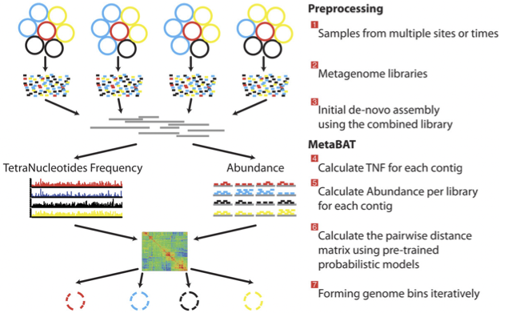
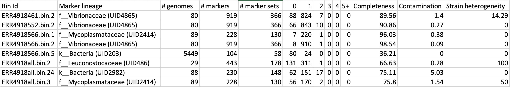
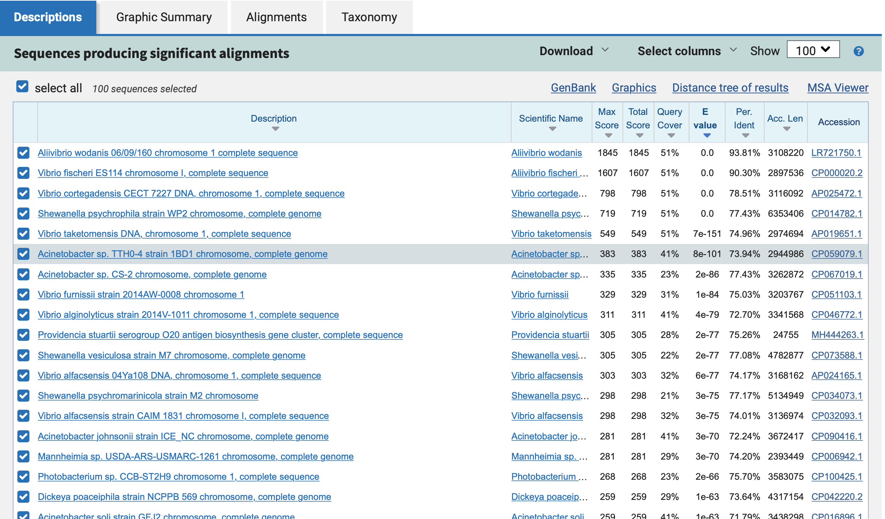

***************
MAG generation
***************

- Generation of metagenome assembled genomes (MAGs) from assemblies
- Assessment of quality (MIGMAGs)
- Taxonomic assignment
- Comparison to public genomes

Prerequisites
---------------

For this tutorial you will need to first setup the docker container by running:

.. code-block:: bash

    cd /course/metagenomics-data/mag_generation/data
    docker run --rm -it -v $(pwd):/opt/data quay.io/microbiome-informatics/holofood-course-2022-mag-generation:latest
    cd /opt/data
    mkdir obs_results

|image1|\ You will notice the outputs of assembly, binning and checkM have been pre-generated for you.
Since some of these processes can take ~1hr we have provided the results to save time. To view the available data run:

.. code-block:: bash

    ls /opt/data

Assembling data
----------------

|image1|\ Learning Objectives - in the following exercises an assembled salmon HoloFood sample has been provided.
You will assess the quality of these assemblies which were used later to generate bins.

Once quality control of sequence reads is complete,
you may want to perform *de novo* assembly in addition to, or
as an alternative to a read-based analyses. The first step is to
assemble your sequences into contigs. There are many tools available for
this, such as MetaVelvet, metaSPAdes, IDBA-UD, MEGAHIT. We generally use
metaSPAdes, as in most cases it yields the best contig size statistics
(i.e. more continguous assembly) and has been shown to be able to
capture high degrees of community diversity (Vollmers, et al. PLOS One
2017). However, you should consider the pros and cons of different
assemblers, which not only includes the accuracy of the assembly, but
also their computational overhead. Compare these factors to what you
have available. For example, very diverse samples with a lot of
sequence data uses a lot of memory with metaSPAdes.

|image1|\ To run metaSPAdes you would execute the following commands (but don't run it now!):

.. code-block:: bash

    mkdir assembly
    metaspades.py -t 4 --only-assembler -m 10 -1 reads/ERR4918566_1.fastq.gz -2 reads/ERR4918566_2.fastq.gz -o assembly

Assemblies can contain contamination from several sources e.g. host, human, PhiX and so on.

PhiX, is a small bacteriophage genome typically used as a
calibration control in sequencing runs. Most library preparations will use PhiX at low concentrations, however it can
still appear in the sequencing run. If not filtered out, PhiX can form small spurious contigs which could
be incorrectly classified as diversity.

|image3|\ Lets assess the resulting assembly contigs file. Run the following to make a PhiX reference database and run blast to identify PhiX contigs in our assembly file:

.. code-block:: bash

    makeblastdb -in assemblies/decontamination/phiX.fna -input_type fasta -dbtype nucl -parse_seqids -out obs_results/phix_blastDB
    blastn -query assemblies/ERR4918566.fasta -db obs_results/phix_blastDB -task megablast -word_size 28 -best_hit_overhang 0.1 -best_hit_score_edge 0.1 -dust yes -evalue 0.0001 -min_raw_gapped_score 100 -penalty -5 -soft_masking true -window_size 100 -outfmt 6 -out obs_results/ERR4918566.blast.out

View the blast results

.. code-block:: bash

    cat obs_results/ERR4918566.blast.out

Use the following link to understand what is in each column https://www.metagenomics.wiki/tools/blast/blastn-output-format-6

|image4|\ Are there any significant hits? What are the lengths of the matching contigs? We would typically filter metagenomic contigs at a length of 500bp. Would any PhiX contamination remain after this filter?

Within the /opt/data/assemblies folder there is a second cleaned contigs file with contigs <500bp filtered out and contamination removed.

|image3|\ Lets assess the statistics of assemblies before and after quality control.

.. code-block:: bash

    gunzip assemblies/ERR4918566_clean.fasta.gz
    assembly_stats assemblies/ERR4918566.fasta > obs_results/assembly_stats.json
    assembly_stats assemblies/ERR4918566_clean.fasta > obs_results/assembly_stats_clean.json

|image1|\ This will output two simple tables in JSON format, but it is
fairly simple to read. To view each file you can open it via the folders or run:

.. code-block:: bash

    cat obs_results/assembly_stats.json
    cat obs_results/assembly_stats_clean.json

|image3|\ What is the length of longest and shortest contigs before and after quality control?

|image3|\ What is the N50 of the two assembly files? Given that the input
sequences were ~150bp long paired-end sequences, what does this tell you
about the assembly?

|image1|\ N50 is a measure to describe the quality of assembled genomes
that are fragmented in contigs of different length.  We can apply this
with some caution to metagenomes, where we can use it to crudely assess
the contig length that covers 50% of the total assembly.  Essentially
the longer the better, but this only makes sense when thinking about
alike metagenomes. Note, N10 is the minimum contig length to cover 10
percent of the metagenome. N90 is the minimum contig length to cover 90
percent of the metagenome.

|image3|\ Now take the first 40 lines of the sequence and perform a blast search
at NCBI (https://blast.ncbi.nlm.nih.gov/Blast.cgi, choose
Nucleotide:Nucleotide from the set of options). Leave all other options
as default on the search page. To select the first 40 lines
perform the following:

.. code-block:: bash

    head -n 41 assemblies/ERR4918566_clean.fasta > obs_results/subset_contigs.fasta

|image6|\

|image3|\ Which species do you think this sequence may be coming from?
Does this make sense as a human oral bacteria? Are you surprised by this
result at all?

Generating metagenome assembled genomes
----------------------------------------

|image1|\ Learning Objectives - in the following exercises you will
- look at some outputs of assembly and binning
- assess the quality of the genomes using checkM
- remove redundancy among genomes
- visualise a placement of these genomes within a reference tree.

**Binning**

|image1|\  As with the assembly process, there are many software tools available for
binning metagenomic assemblies. Examples include, but are not limited to:

MaxBin: https://sourceforge.net/projects/maxbin

CONCOCT: https://github.com/BinPro/CONCOCT

MetaBAT: https://bitbucket.org/berkeleylab/metabat

MetaWRAP: https://github.com/bxlab/metaWRAP

There is no clear winner between these tools, so the best approach is to
experiment and compare a few different ones to determine which works
best for your dataset.

For this exercise the bins have been generated using **metaWRAP** which uses a combination of the 3 tools above.
However we have also provided the output of **MetaBAT** for the assembly above. The way in which MetaBAT bins contigs together
is summarised in Figure 1.

|image2|\

Figure 1. MetaBAT workflow (Kang, et al. *PeerJ* 2015).

|image1|\ To run MetaBAT you would execute the following commands (but don't run it now!):

Prior to running , we need to generate coverage
statistics by mapping reads to the contigs. To do this, we can use bwa
(http://bio-bwa.sourceforge.net/) and then the samtools software
(`http://www.htslib.org <http://www.htslib.org/>`__) to reformat the
output. Again, this can take some time, so we have run it in advance. To
repeat the process, you would run the following commands:

.. code-block:: bash

    # index the contigs file that was produced by metaSPAdes:
    bwa index ERR4918566_clean.fasta

    # map the original reads to the contigs:
    bwa mem ERR4918566_clean.fasta ERR4918566_1.fastq.gz ERR4918566_2.fastq.gz > input.fastq.sam

    # reformat the file with samtools:
    samtools view -Sbu input.fastq.sam > junk
    samtools sort junk input.fastq.sam

    # calculate coverage depth for each contig
    jgi_summarize_bam_contig_depths --outputDepth contigs.fasta.depth.txt input.fastq.sam.bam

    # run MetaBAT
    metabat2 --inFile ERR4918566_clean.fasta --outFile ERR4918566_metabat/bin --abdFile contigs.fasta.depth.txt

|image1|\ Once the binning process is complete, each bin will be
grouped into a multi-fasta file with a name structure of
**bin.[0-9].fa**.

|image3|\ Inspect the output of the binning process.

.. code-block:: bash

    ls bins/ERR4918566_metabat/metabat2_bins
    grep -c '>' bins/ERR4918566_metabat/metabat2_bins/*.fa

|image4|\  How many bins did the process produce?

|image4|\  How many sequences are in each bin?

|image1|\ We have provided you with a subset of bins from several HoloFood salmon sample assemblies, including one co-assembly.

.. code-block:: bash

    ls bins/*.fa

**Assessing genome quality**

Not all bins will have the same level of accuracy since some
might represent a very small fraction of a potential species present in
your dataset. To further assess the quality of the bins we will use
**CheckM** (https://github.com/Ecogenomics/CheckM/wiki).

|image1|\  **CheckM** has its own reference database of single-copy
marker genes. Based on the proportion of these markers
detected in the bin, the number of copies of each and how different they
are, it will determine the level of **completeness**, **contamination**
and **strain heterogeneity** of the predicted genome.
Once again, this can take some time, so we have run it in advance. To
repeat the process, you would run the following command:

.. code-block:: bash

    # This program has some handy tools not only for quality control, but also for taxonomic classification, assessing coverage, building a phylogenetic tree, etc. The most relevant ones are wrapped into the lineage_wf workflow.
    checkm lineage_wf -x fa bins/ checkM/checkm_output/ --tab_table -f checkM/bins_qa.tab -t 4

|image3|\ To inspect the summary output file of checkM:

.. code-block:: bash

    cat checkM/bins_qa.tab

|image5|\

Figure 2. Example output of CheckM

|image1|\ This file contains the taxonomic assignment and quality assessment of each
bin with the corresponding level of
**completeness**, **contamination** and **strain heterogeneity** A quick way to infer the overall quality of the bin is to calculate the quality score:
**(completeness - 5*contamination)**.
You should be aiming for an minimum score of at
least **50%**. Whereby if the genome is only 50% complete, contamination must be 0.

|image4|\ Based on the above formula for quality score, how many genomes pass this filter?

|image4|\ Do any of the genomes have a similar taxonomic annotation? What might this mean?

**Getting species representatives**

|image1|\ Next we will de-replicate our genomes to generate species level clusters and select a representative MAG per species.
We will use dRep to do this. dRep can rapidly and accurately compare a list of genomes in a pair-wise manner.
This allows identification of groups of organisms that share similar DNA content in terms of Average Nucleotide Identity (ANI).

|image3|\ To prepare for de-replication:

.. code-block:: bash

    # identify bins with a minimum quality score of 50 and generate csv summary
    echo "genome,completeness,contamination" > obs_results/quality.csv
    awk -F "\t" -v OFS=',' '{ if ($12 - ($13 * 5) >= 50) print $1,$12,$13}' mag_generation/bins_qa.tab >> obs_results/quality.csv

    # copy bin folder to our output folder
    cp -r data/bins/ obs_results/
    # filter lower quality bins into a separate folder
    mkdir obs_results/poor-bins
    mv obs_results/bins/ERR4918566.bin.5.fa obs_results/poor-bins/
    mv obs_results/bins/ERR4918all.bin.24.fa obs_results/poor-bins/

|image3|\ Now run dRep with this command:

.. code-block:: bash

    dRep dereplicate obs_results/drep/ -g obs_results/bins/*.fa -pa 0.9 -sa 0.95 -nc 0.6 -cm larger --genomeInfo obs_results/quality.csv -comp 50 -con 5

|image4|\ Using the following manual https://drep.readthedocs.io/en/latest/module_descriptions.html#dereplicate can you identify the ANI and coverage thresholds used to compare the genomes?

|image3|\ Inspect the output files:

.. code-block:: bash

    # The folder of representative genomes per species
    ls obs_results/drep/dereplicated_genomes/

    # The cluster and score of de-replicated genomes
    cat obs_results/drep/data_tables/Wdb.csv

    # Pair-wise Mash comparison results of all bins
    cat obs_results/drep/data_tables/Mdb.csv

|image4|\ How many species representative MAGs were produced?

**Taxonomic Classification**

|image1|\ Finally we will look at the taxonomic assignments of our species representative MAGs

This can be done in a few different ways. One example is the checkM **lineage_wf** analysis perfomed above which also produces a reference tree which can be
found in checkM/checkm_output/storage/tree/concatenated.tre.

However we will compare our genomes to the genome taxonomy database (GTDB). GTDB is a standardised microbial taxonomy based on genome phylogeny.
GTDB phylogeny is constructed using a mixture of isolate genomes and MAGs obtained from RefSeq and GenBank.
The GTDB-Tk toolkit performs a rapid classification producing a multiple sequence alignment to the GTDB reference and best lineage matches.

For the purpose of this practical, we have used the 3 salmon gut MAGs generated today and a set of HoloFood chicken ileum MAGs to generate a phylogenetic tree.
We have run GTDB-Tk it in advance with all the mentioned genomes. To
repeat the process, you would run the following commands (don't run this now!):

.. code-block:: bash

    # running the gtdb workflow
    gtdbtk classify_wf --cpus 2 --genome_dir folder-of-genomes/ --out_dir tree/ -x fa"

    # generate a phylogenetic tree using the multiple sequence alignment
    iqtree2 -nt 16 -s tree/gtdbtk.bac120.user_msa.fasta

|image3|\ Inspect the GTDB files:

.. code-block:: bash

    # first exit the docker container
    exit

    # navigate to the output directory
    cd /course/metagenomics-data/tree

The GTDB-tk summary file **/course/metagenomics-data/tree/gtdbtk.bac120.summary.tsv** contains all the genomes from chicken ileum and salmon.

|image3|\ View the GTDB output for the salmon MAGs generated today:

.. code-block:: bash

    # select the 3 MAGs
    head -n1 gtdbtk.bac120.summary.tsv > mags_taxonomy.tsv
    grep -E 'ERR4918566_bin.1|ERR4918566_bin.2|ERR4918all_bin.2' gtdbtk.bac120.summary.tsv >> mags_taxonomy.tsv
    cat mags_taxonomy.tsv

|image4|\ Are any MAGs classified to the species level? For this MAG what is the closest reference genome in GTDB.

|image4|\ Search the reference genome in https://gtdb.ecogenomic.org Is it derived from an isolate or MAG?

**Visualising the phylogenetic tree**

We will now plot and visualize the tree we have produced. A quick and
user- friendly way to do this is to use the web-based **interactive Tree
of Life** (**iTOL**): http://itol.embl.de/index.shtml

|image3|\  To use **iTOL** you will need a user account, or we have already created a tree you can visualise.
The login is as follows:

**User:**\  *EBI_training*

**Password:**\  *EBI_training*

After you login, just click on **My Trees** in the toolbar at the top
and select

**holofood.bac120.treefile** from the **Imported trees** workspace.

Alternatively, if you want to create your own account and plot the tree
yourself follow these steps:

   **1)** After you have created and logged in to your account go to **My Trees**

   **2)** From there select **Upload tree files** and locate the tree to upload in the path:
    /course/metagenomics-data/tree/gtdbtk.bac120.user_msa.fasta.treefile

   **3)** Once uploaded, click the tree name to visualize the plot.

   **You will find several annotation files starting "itol" in the same folder as above**

   **4)** To colour the clades and the outside circle according to the
   phylum of each genome, drag and drop the files **itol_gtdb-legend.txt** onto the tree.

   **5)** To colour outer ring according to "novelty" drag and drop the file **itol_gtype-layer.txt** onto the tree.
   "Novel" is shown in green and refers to genomes not classified to species level in GTDB. "Existing" is in blue.

   **6)** Reformat the tree to see the labels: On the basic control panel select Labels - Display and Label options - At tips

   **7)** Finally to highlight the 3 MAGs produced today, drag and drop the files **itol_mags-bold.txt** onto the tree.

Feel free to play around with the plot.

|image4|\ What is the genome most closely related to our salmon MAG ERR4918566 bin.2? Can you find the taxonomic lineage
for this genome in the GTDB output file /course/metagenomics-data/tree/gtdbtk.bac120.summary.tsv?

.. hint::
    Replace the space with '_' when searching the file.

**Compare genomes to public MAG catalogue in MGnify**

**Sandy to fill**

