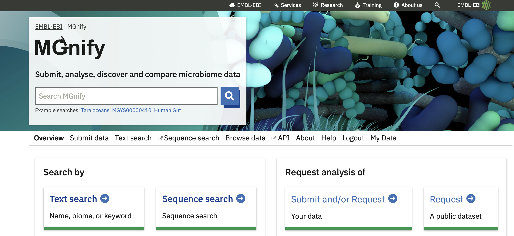

Metagenomics data practical session
===================================
.. hint::
    This practical session uses software and datasets available on the course-provided virtual machines.
    To follow this workshop at a later date, see `the github repo <https://github.com/ebi-metagenomics/hfcourse>`_ for installation instructions.

Step 1: using the MGnify metagenomics resource
----------------------------------------------

    Homepage of the MGnify website.