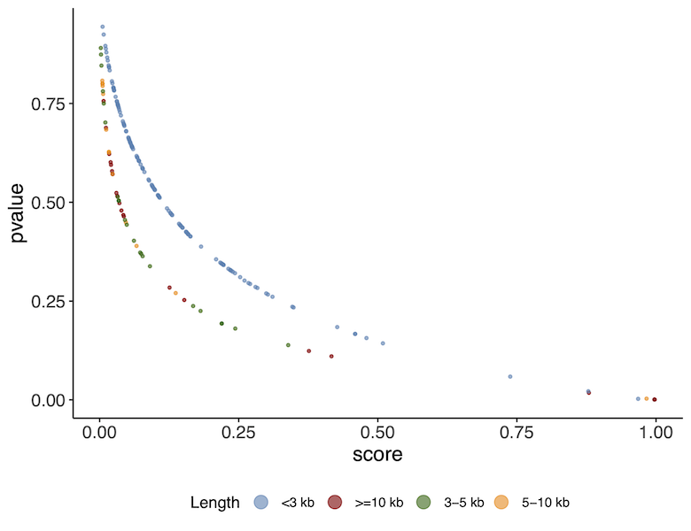
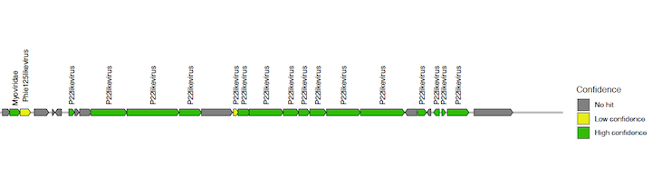

******************************************************
Metagenomic analysis of Eukaryotic and Virus kingdoms
******************************************************

Eukaryotic annotation with EukCC
----------------------------------

Prerequisites
---------------

For this tutorial you will need to first navigate to the required directory:

.. code-block:: bash

    # navigate to directory
    cd /course/metagenomics-data/eukaryotes

|image1|\ EukCC is a tool for estimating the quality of eukaryotic genomes based on the automated dynamic selection of single copy marker gene sets, providing **completeness** and **contamination** values.
https://genomebiology.biomedcentral.com/articles/10.1186/s13059-020-02155-4

We will run EukCC on 3 bins generated from HoloFood chicken caecum samples produced by CONCOCT and MetaBAT.

|image3|\ To run EukCC use the following commands:

.. code-block:: bash

    docker run --rm -it -v /course/metagenomics-data/eukaryotes/data:/opt/data quay.io/microbiome-informatics/eukcc folder --out /opt/data/euk_classification --db /opt/data/eukcc_db/ /opt/data/eukaryotic_bins/

.. hint::
    This will take ~25mins to run. Leave it running and come back to the rest of this section at the end.
    Alternatively continue with the pre-generated output.

|image3|\ Inspect the EukCC output:

.. code-block:: bash

    # if using your own results
    cat euk_classification/eukcc.csv

    # if using pre-generated output
    cat /course/metagenomics-data/eukaryotes/expected_output/euk_classification/eukcc.csv

|image4|\ How many of the genomes have good completeness with respect to the EukCC database?
|image4|\ What are these genomes classified as?

Viral annotation with VIRify
-------------------------------

Prerequisites
---------------

Open a new terminal.

Now change into the **virify_tutorial** directory and setup the environment by running the following commands in your current terminal session:

.. code-block:: bash

    cd /course/metagenomics-data/virify_tutorial
    docker load --input docker/virify.tar
    docker run --rm -it -v $(pwd)/data:/opt/data virify
    mkdir obs_results
    
All commands detailed below will be run from within this current working directory.
Note: if there are any issues in running this tutorial, there is a separate directory **exp_results/** with pre-computed results.

1. Identification of putative viral sequences
---------------------------------------------

|image1|\  In order to retrieve putative viral sequences from a set of metagenomic contigs we are going to use two different tools designed for this purpose, each of which employs a different strategy for viral sequence detection: **VirFinder** and **VirSorter**. VirFinder uses a prediction model based on kmer profiles trained using a reference database of viral and prokaryotic sequences. In contrast, VirSorter mainly relies on the comparison of predicted proteins with a comprehensive database of viral proteins and profile HMMs. The **VIRify pipeline** uses both tools as they provide complementary results:

•	**VirFinder** performs better than VirSorter for short contigs (<3kb) and includes a prediction model suitable for detecting both eukaryotic and prokaryotic viruses (phages).

•	In addition to reporting the presence of phage contigs, **VirSorter** detects and reports the presence of prophage sequences (phages integrated in contigs containing their prokaryotic hosts).

|image3|\  1.2 In the current working directory you will find the metagenomic assembly we will be working with (**ERR575691_host_filtered.fasta**). We will now filter the contigs listed in this file to keep only those that are ≥500 bp, by using the custom python script filter_contigs_len.py as follows:

.. code-block:: bash

    filter_contigs_len.py -f ERR575691_host_filtered.fasta -l 0.5 -o obs_results/ERR575691_host_filtered_filt500bp.fasta

|image3|\  1.3. The output from this command is a file named **ERR575691_host_filtered_filt500bp.fasta** which is located in the **obs_results** diretory. Our dataset is now ready to be processed for the detection of putative viral sequences. We will first analyse it with VirFinder using a custom R script:

.. code-block:: bash

    VirFinder_analysis_Euk.R -f obs_results/ERR575691_host_filtered_filt500bp.fasta -o obs_results

|image3|\  1.4. Following the execution of the R script you will see a tabular file (**obs_results/ERR575691_host_filtered_filt500bp_VirFinder_table-all.tab**) that collates the results obtained for each contig from the processed FASTA file. The next step will be to analyse the metagenomic assembly using VirSorter. To do this run:

.. code-block:: bash

    wrapper_phage_contigs_sorter_iPlant.pl -f obs_results/ERR575691_host_filtered_filt500bp.fasta --db 2 --wdir obs_results/virsorter_output --virome --data-dir /opt/data/databases/virsorter-data

|image1|\  **VirSorter classifies its predictions into different confidence categories:**

 - **Category 1**: "most confident" predictions
 - **Category 2**: "likely" predictions
 - **Category 3**: "possible" predictions
 - **Categories 4-6**: predicted prophages

|image3|\  1.5. While VirSorter is running, we have prepared an R script so you can inspect the VirFinder results in the meantime using ggplot2. Open RStudio and load the **Analyse_VirFinder.R** script located in the **/virify_tutorial/data/scripts/** directory. Run the script (press Source on the top right corner) to generate the plot. (If you don't have RStudio, or don't care to run this you can just look at the resulting plot in the image below)

|image2|\

|image1|\  As you can see there is a relationship between the **p-value** and the **score**. A higher score or lower p-value indicates a higher likelihood of the sequence being a viral sequence. You will also notice that the results correlate with the **contig length**. The curves are slightly different depending on whether the contigs are > or < than 3kb. This is because VirFinder uses different machine learning models at these different levels of length.

|image3|\  1.6. Once VirSorter finishes running, we then generate the corresponding viral sequence FASTA files using a custom python script (**parse_viral_pred.py**) as follows:

.. code-block:: bash

    parse_viral_pred.py -a obs_results/ERR575691_host_filtered_filt500bp.fasta -f obs_results/ERR575691_host_filtered_filt500bp_VirFinder_table-all.tab -s obs_results/virsorter_output -o obs_results

Following the execution of this command, FASTA files (*.fna) will be generated for each one of the VIRify categories mentioned above containing the corresponding putative viral sequences.

**The VIRify pipeline takes the output from VirFinder and VirSorter, reporting three prediction categories:**

 - **High confidence**: VirSorter phage predictions from **categories 1 and 2**.
 - **Low confidence**:
  - Contigs that VirFinder reported with **p-value < 0.05 and score ≥ 0.9.**\
  - Contigs that VirFinder reported with **p-value < 0.05 and score ≥ 0.7**, but that are also reported by VirSorter in **category 3.**\
 - **Prophages**: VirSorter prophage predictions **categories 4 and 5.**

2. Detection of viral taxonomic markers
---------------------------------------

|image1|\  Once we have retrieved the putative viral sequences from the metagenomic assembly, the following step will be to analyse the proteins encoded in them in order to identify any viral taxonomic markers. To carry out this identification, we will employ a database of **profile Hidden Markov Models (HMMs)** built from proteins encoded in viral reference genomes. These profile HMMs were selected as viral taxonomic markers following a comprehensive random forest-based analysis carried out previously. 

|image3|\  2.1. The VIRify pipeline uses **prodigal** for the detection of **protein coding sequences (CDSs**) and **hmmscan** for the alignment of the encoded proteins to each of the profile HMMs stored in the aforementioned database. We will use the custom script **Generate_vphmm_hmmer_matrix.py** to conduct these steps for each one of the FASTA files sequentially in a “for loop”. In your terminal session, execute the following command:

.. code-block:: bash

    for file in $(find obs_results/ -name '*.fna' -type f | grep -i 'putative'); do Generate_vphmm_hmmer_matrix.py -f ${file} -o ${file%/*}; done

Once the command execution finishes two new files will be stored for each category of viral predictions. The file with the suffix **CDS.faa** lists the proteins encoded in the CDSs reported by prodigal, whereas the file with the suffix **hmmer_ViPhOG.tbl** contains all significant alignments between the encoded proteins and the profile HMMs, on a per-domain-hit basis. 

|image3|\  2.2. The following command is used to parse the hmmer output and generate a new tabular file that lists alignment results in a per-query basis, which include the **alignment ratio** and absolute value of total **E-value** for each protein-profile HMM pair.

.. code-block:: bash

    for file in $(find obs_results/ -name '*ViPhOG.tbl' -type f); do Ratio_Evalue_table.py -i ${file} -o ${file%/*}; done

3. Viral taxonomic assignment
-----------------------------

|image1|\  The final output of the VIRify pipeline includes a series of gene maps generated for each putative viral sequence and a tabular file that reports the taxonomic lineage assigned to each viral contig. The gene maps provide a convenient way of visualizing the taxonomic annotations obtained for each putative viral contig and compare the annotation results with the corresponding assigned taxonomic lineage. Taxonomic lineage assignment is carried out from the highest taxonomic rank (genus) to the lowest (order), taking all the corresponding annotations and assessing whether the most commonly reported one passes a pre-defined assignment threshold.

|image3|\  3.1. First, we are going to generate a tabular file that lists the taxonomic annotation results obtained for each protein from the putative viral contigs. We will generate this file for the putative viral sequences in each prediction category. Run the following:

.. code-block:: bash

    for file in $(find obs_results/ -name '*CDS.faa' -type f); do viral_contigs_annotation.py -p ${file} -t ${file%CDS.faa}hmmer_ViPhOG_informative.tsv -o ${file%/*}; done

|image3|\  3.2. Next, we will take the tabular annotation files generated and use them to create the viral contig gene maps. To achieve this, run the following:

.. code-block:: bash

    for file in $(find obs_results/ -name '*annot.tsv' -type f); do Make_viral_contig_map.R -t ${file} -o ${file%/*}; done

|image3|\  3.3. Finally, we will use the tabular annotation files again to carry out the taxonomic lineage assignment for each putative viral contig. Run the following command:

.. code-block:: bash

    for file in $(find obs_results/ -name '*annot.tsv' -type f); do contig_taxonomic_assign.py -i ${file} -o ${file%/*}; done

Final output results are stored in the **obs_results/** directory. 

The gene maps are stored per contig in individual **PDF files** (suffix names of the contigs indicate their level of confidence and category class obtained from VirSorter). Each protein coding sequence in the contig maps (PDFs) is coloured and labeled as **high confidence** (E-value < 0.1), **low confidence** (E-value > 0.1) or **no hit**, based on the matches to the HMM profiles. Do not confuse this with the high confidence or low confidence prediction of VIRify for the **whole contig**.

Taxonomic annotation results per classification category are stored as text in the ***_tax_assign.tsv** files. 

Let’s inspect the results. Do:

.. code-block:: bash

    cat obs_results/*tax_assign.tsv

You should see a list of **9 contigs** detected as viral and their taxonomic annotation in separate columns (partitioned by taxonomic rank). However, some do not have an annotation (e.g. **NODE_4...** and **NODE_5...**).

Open the gene map PDF files of the corresponding contigs to understand why some contigs were **not assigned** to a taxonomic lineage. You will see that for these cases, either there were not enough genes matching the HMMs, or there was disagreement in their assignment.

|image5|\

Example of gene map file

.. |image1| image:: images/info.png
   :width: 0.26667in
   :height: 0.26667in

.. |image3| image:: images/action.png
   :width: 0.25in
   :height: 0.25in
.. |image4| image:: images/question.png
   :width: 0.26667in
   :height: 0.26667in

